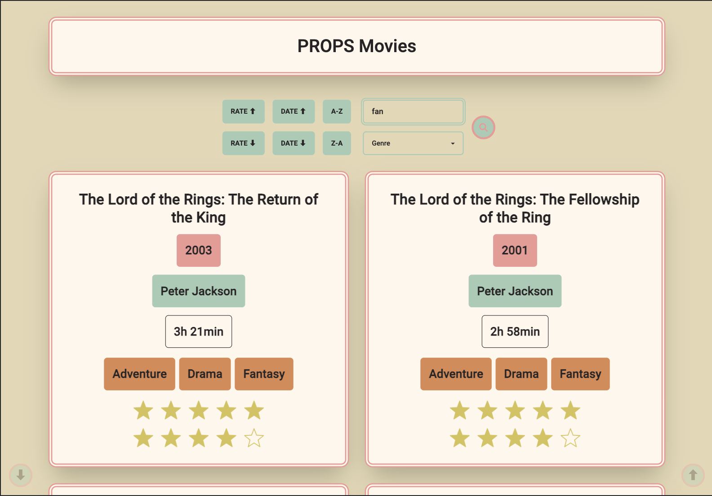

# React + Vite + Tailwind + daisyui

# [Netlify Deployment](https://luxury-cendol-5bf0c6.netlify.app/)

The App can sort movies alphabetically, by date and rate. It is also possible to search for titles, directors, years and genres.

I have also added 2 autoscroll buttons, to scroll to the top or the bottom of the page.

I followed the best SetUp for vite(react)+tailwind: [this freecodecamp SetUp](https://www.freecodecamp.org/news/how-to-install-tailwindcss-in-react/)

# Mobile

# Desktop

