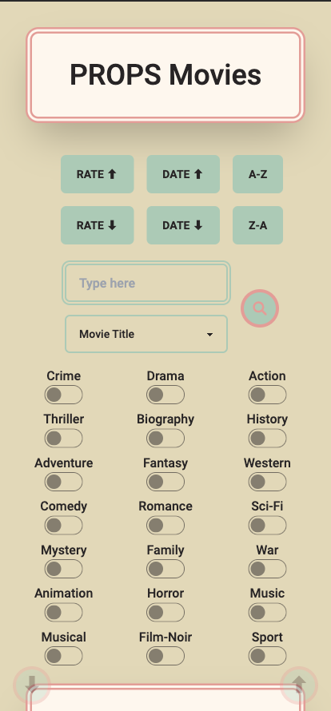
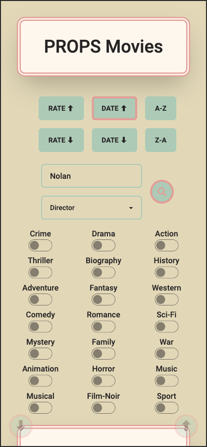
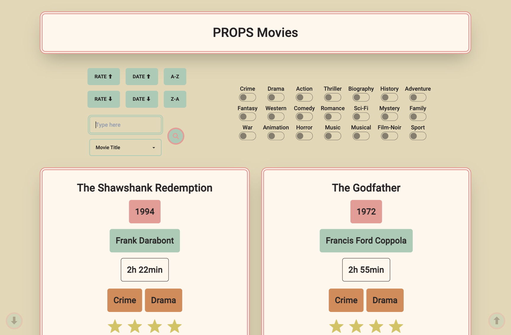

# React + Vite + Tailwind + daisyui

# [Netlify Deployment](https://luxury-cendol-5bf0c6.netlify.app/)

You can sort the films alphabetically, according to their rate, or their year, either descending or ascending. You can also search for titles, directors, year or genre directly in the search function. The simultaneous genre search also works and can be combined with the other search options.

I have also added 2 autoscroll buttons, to scroll to the top or the bottom of the page.

I followed the best SetUp guide for vite(react)+tailwind: [this freecodecamp SetUp](https://www.freecodecamp.org/news/how-to-install-tailwindcss-in-react/)

# Mobile

# Desktop

